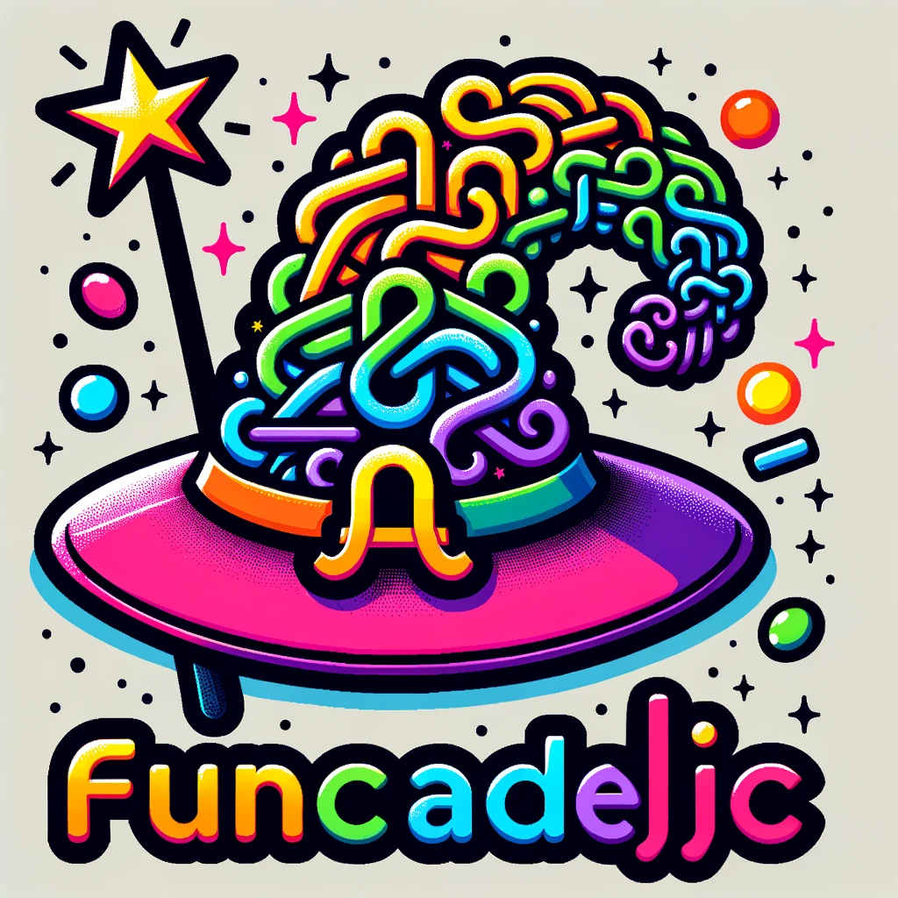

# 🤖 funcadelic.js

Hello, Functional Enthusiasts! Welcome to the quirky land of `funcadelic.js`, a place where JavaScript meets functional programming. If you ever thought that programming could use a sprinkle of fun, then you're in the right place. 🎡

## Overview 🎪

`funcadelic.js` is a set of functional utilities implemented in pure ESM JS. It's like giving your JavaScript a functional candy 🍬 that tastes _purely_ sweet! Whether you want to compose functions like a maestro, tread through them seamlessly, or just need an identity check for your existential crises, `funcadelic.js` has got you covered.

## Features 🎢

- **Compose**: Mix and match functions like ingredients in a magical potion. 🍵
- **Identity**: Because sometimes, you just need to be yourself! 🦄
- **ThreadFirst**: Thread through your functions as if you're weaving through a carnival maze. 🌪
- **ComposePredicates**: Because why have one predicate when you can have a party of them? 🎉

## How to Contribute 🤹

We believe in the magic of collaboration! If you're a wizard, witch, or even a muggle with an idea, here's how you can join the `funcadelic.js` carnival:

1. **Fork and Clone**: Fork this repository and clone it to your local machine. Make sure you have the spell book (a.k.a. `package.json`) with you.
2. **Branch Out**: Create a new branch for your enchanting feature or spellbinding fix.
3. **Write the Magic**: Implement your feature or fix, but wait! For every spell you cast (a.k.a. function you write), you need to craft its prophecy (a.k.a. specs or tests). We believe in the saying: "A function without specs is like a wizard without a wand!" 🪄
4. **Test the Magic**: Run the tests using the command `npm test`. Ensure that all the prophecies come true.
5. **Pull Request**: Once your magic is ready, create a Pull Request against our main branch. Our team of magical creatures will review it and, if deemed worthy, will integrate it into our grand spell book.

## Bugs & Issues 🕷

Encountered a dragon? 🐉 Or maybe just a bug? Head over to our [issues](https://github.com/Dorky-Robot/funcadelicjs/issues) section and let us know. We'll summon our best dragon tamers and bug squashers!

## Author 🧙

Crafted with love and magic by [Felix Flores](https://github.com/Dorky-Robot). He's not a real wizard, but he sure does some enchanting coding!

## License 📜

Licensed under the ISC license. Basically, it's a spell that lets you use, modify, and distribute the code, but you can't sue us if it turns your codebase into a pumpkin at midnight.
