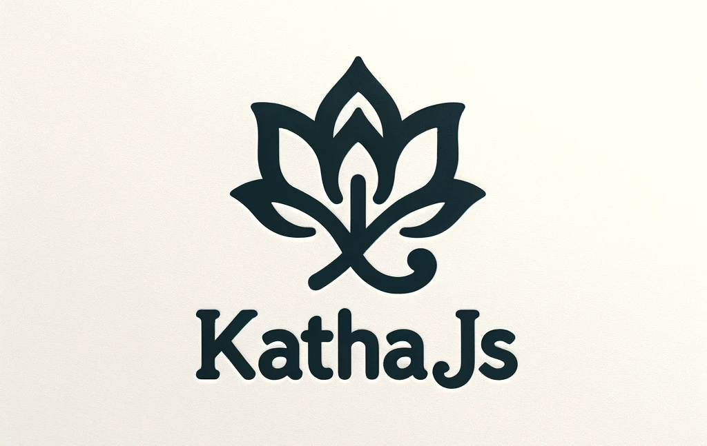

# Katha.js



Katha.js is a compact yet mighty functional programming utility library for JavaScript. Designed to be small and straightforward, it provides all the essential tools for functional programming without any unnecessary complexity. Katha.js streamlines your code, making it more concise, readable, and maintainable, ensuring you have everything you need for functional programming in a neat and simple package.

Katha.js simplifies common functional programming tasks in JavaScript, providing powerful utilities like function composition, currying, and more. It's designed to improve the developer experience by offering intuitive and easy-to-use functional constructs.

With Katha:

```javascript
const processObject = katha.pipe(
  katha.mapObject((x) => x + 1), // Increment each value in the object
  katha.filterObject((x) => x % 2 === 0), // Keep only even values
  katha.foldObject((acc, x) => acc + x, 0) // Sum the values
);

const data = { a: 1, b: 2, c: 3 };
console.log(processObject(data)); // Outputs: 6 (After increment: {a: 2, b: 3, c: 4}, then {a: 2, c: 4}, sum is 6)
```

Without:

```javascript
function processObject(data) {
  // Increment each value in the object
  let incrementedValues = {};
  for (const key in data) {
    if (data.hasOwnProperty(key)) {
      incrementedValues[key] = data[key] + 1;
    }
  }

  // Keep only even values
  let evenValues = {};
  for (const key in incrementedValues) {
    if (
      incrementedValues.hasOwnProperty(key) &&
      incrementedValues[key] % 2 === 0
    ) {
      evenValues[key] = incrementedValues[key];
    }
  }

  // Sum the values
  let sum = 0;
  for (const key in evenValues) {
    if (evenValues.hasOwnProperty(key)) {
      sum += evenValues[key];
    }
  }

  return sum;
}

const data = { a: 1, b: 2, c: 3 };
console.log(processObject(data)); // Outputs: 6
```

## Getting Started

Include Katha.js in your project to start using its functional utilities.

### Usage

To install Katha.js, run the following command in your project directory:

```
npm install katha.js
```

#### In the Browser

You can also use Katha.js directly in the browser through a CDN:

```html
<script src="https://unpkg.com/katha.js/dist/katha.bundle.min.js"></script>
<script>
  // Katha.js is now available as a global object `katha`
  const { compose, mapObject } = katha;

  // Example usage
  const double = (x) => x * 2;
  const doubledValues = mapObject(double)({ a: 1, b: 2 });
  console.log(doubledValues); // Outputs: { a: 2, b: 4 }
</script>
```

## Explore Katha.js Functionalities

Katha.js brings a suite of elegant and powerful functional programming tools to your JavaScript projects. Here’s how each function can transform the way you write code:

### Compose

`compose` seamlessly blends multiple functions into one, allowing you to create sophisticated logic in a simple, linear flow.

```javascript
const addOne = (x) => x + 1;
const double = (x) => x * 2;
const addOneThenDouble = compose(double, addOne);
console.log(addOneThenDouble(3)); // Outputs: 8
```

### Identity

`identity` is the epitome of simplicity, returning whatever it's given, unaltered — perfect for situations where a no-operation function is needed.

```javascript
console.log(identity('Katha.js')); // Outputs: 'Katha.js'
```

### ThreadFirst

`threadFirst` lets you apply a series of functions or function-argument pairs to an initial value, creating a fluid and intuitive flow of data.

```javascript
const add = (x, y) => x + y;
const threadFirstExample = threadFirst(2, [add, 3], [double]);
console.log(threadFirstExample); // Outputs: 10
```

### ComposePredicates

`composePredicates` combines multiple predicates into a single one, enabling complex logical conditions to be succinctly expressed.

```javascript
const isEven = (x) => x % 2 === 0;
const isPositive = (x) => x > 0;
const isEvenAndPositive = composePredicates(isEven, isPositive);
console.log(isEvenAndPositive(4)); // Outputs: true
```

### Curry

`curry` transforms a multi-argument function into a chain of functions, each taking a single argument. It’s a powerful way to create highly modular and reusable code.

```javascript
const sum = (a, b, c) => a + b + c;
const curriedSum = curry(sum);
console.log(curriedSum(1)(2)(3)); // Outputs: 6
```

### Pipe

`pipe` is similar to `compose` but in reverse order. It creates a pipeline of functions, where the output of one is the input to the next.

```javascript
const pipeExample = pipe(addOne, double);
console.log(pipeExample(3)); // Outputs: 8
```

### `mapObject`

The `mapObject` function has been enhanced to support a wider range of inputs, making it versatile for handling objects, arrays, and multiple arguments:

#### Features

- **Objects**: Transforms each value in an object using a specified function, returning a new object with the transformed values.
- **Arrays**: Applies a function to each element in an array, returning a new array with the results.
- **Multiple Arguments**: Maps a function over multiple arguments. If the first argument is `null`, it skips the first and starts mapping from the second argument.

#### Usage Examples

1. **Object Mapping:**

   ```javascript
   const double = (x) => x * 2;
   const obj = { a: 1, b: 2 };
   console.log(mapObject(double)(obj)); // Returns { a: 2, b: 4 }
   ```

2. **Array Mapping:**

   ```javascript
   const arr = [1, 2, 3];
   console.log(mapObject(double)(arr)); // Returns [2, 4, 6]
   ```

3. **Mapping Multiple Arguments:**
   ```javascript
   // Note: If the first argument is null, it is ignored.
   console.log(mapObject(double)(null, 1, 2, 3)); // Returns [2, 4, 6]
   ```

### FilterObject

`filterObject` helps you selectively filter properties of an object based on a predicate, streamlining your data processing.

```javascript
const filteredObject = filterObject(isEven)(obj);
console.log(filteredObject); // Outputs: { b: 2 }
```

### Maybe

`maybe` gracefully handles nullable values by applying a function only if the input is not null or undefined.

```javascript
const maybeDouble = maybe(double);
console.log(maybeDouble(5)); // Outputs: 10
console.log(maybeDouble(null)); // Outputs: null
```

### Either

`either` elegantly chooses between two functions based on the nullity of the input, simplifying conditional logic.

```javascript
const eitherExample = either(() => 'Null input', double);
console.log(eitherExample(null)); // Outputs: 'Null input'
console.log(eitherExample(5)); // Outputs: 10
```

### FoldObject

`foldObject` reduces an object's properties to a single value, providing a powerful tool for aggregating data.

```javascript
const sumValues = foldObject((acc, x) => acc + x, 0);
console.log(sumValues(obj)); // Outputs: 3
```

Each function in Katha.js is designed to make your functional programming journey in JavaScript both enjoyable and efficient. Try them out and experience the difference!

## Elegant Harmonious Composition Example

Let's create a function that combines these features in a meaningful way. For example, we can create a function that processes an object of numeric values, applying a series of transformations and calculations:

```javascript
const processObject = katha.pipe(
  katha.mapObject((x) => x + 1), // Increment each value in the object
  katha.filterObject((x) => x % 2 === 0), // Keep only even values
  katha.foldObject((acc, x) => acc + x, 0) // Sum the values
);

const data = { a: 1, b: 2, c: 3 };
console.log(processObject(data)); // Outputs: 6 (After increment: {a: 2, b: 3, c: 4}, then {a: 2, c: 4}, sum is 6)
```

In this example, `processObject` is a composition of several functional utilities provided by Katha.js. It demonstrates how you can elegantly chain together transformations and calculations in a clear, functional style. This approach encapsulates complex operations in a readable and maintainable way, showcasing the power and elegance of functional programming in JavaScript.

## Contributing

Contributions to Katha.js are welcome! Please read our contribution guidelines for details on how to contribute to the project.

## Reporting Issues

If you encounter any issues or bugs while using Katha.js, please report them in our [issues tracker](https://github.com/Dorky-Robot/katha.js/issues).

## License

Katha.js is licensed under the ISC license. See the LICENSE file for more details.
